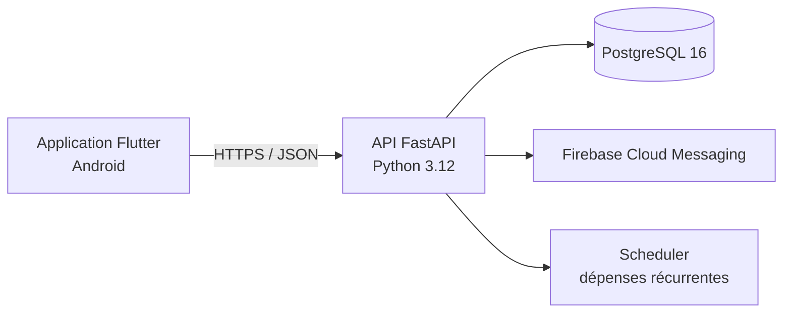

<div align="center">
  
  <h1>Tabby</h1>
  <p><strong>Partage de dépenses, suivi budgétaire et cartes de fidélité dans une seule application.</strong></p>
  <p>
    <a href="https://flutter.dev/"></a>
    <a href="https://fastapi.tiangolo.com/"></a>
    <a href="https://www.postgresql.org/"></a>
    <a href="./LICENSE"></a>
  </p>
</div>

## À propos

Tabby est une application Android self-hosted inspirée de Tricount et Splitwise. Elle réunit trois usages complémentaires :

- répartir les dépenses entre les membres de plusieurs groupes ;
- visualiser ses dépenses personnelles et partagées dans un espace budget ;
- conserver et présenter ses cartes de fidélité.

L'interface repose sur un design system Material 3 Expressive, avec thèmes clair et sombre, animations, typographie variable et localisation française/anglaise.

## Fonctionnalités

### Dépenses partagées

- création et gestion de plusieurs groupes ;
- invitation par code, épinglage et administration du groupe ;
- répartition égale, par parts ou par montants personnalisés ;
- choix du payeur et des participants ;
- calcul automatique des soldes et des dettes ;
- déclaration, confirmation ou rejet des remboursements ;
- dépenses récurrentes et notifications push.

### Budget personnel et statistiques

- saisie de dépenses personnelles hors groupe ;
- budgets mensuels par catégorie ;
- vue consolidée des dépenses personnelles et de groupe ;
- navigation par mois et ventilation visuelle par catégorie ;
- catégories personnalisables ;
- dépenses personnelles récurrentes.

### Wallet de fidélité

- ajout manuel ou scan d'un code-barres/QR code ;
- reconnaissance depuis une capture d'écran ;
- catalogue de marques et personnalisation des cartes ;
- affichage plein écran pour le passage en caisse ;
- plusieurs présentations et réorganisation du wallet.

### Compte et expérience mobile

- authentification par access token et refresh token ;
- verrouillage biométrique optionnel ;
- avatar, profil, langue et préférence de thème ;
- gestion explicite des états de chargement, d'erreur et de connectivité.

## Architecture



Le dépôt est organisé en monorepo :

```text
tabby/
├── app/       # Application Flutter, Cubits, repositories et design system
├── backend/   # API FastAPI, modèles SQLAlchemy, migrations et Docker
└── docs/      # Références API, UI, déploiement et validation
```

### Stack principale

| Couche | Technologies |
| --- | --- |
| Mobile | Flutter, Dart, flutter_bloc, go_router, Dio |
| Interface | Material 3, material_ui, Google Sans Flex, Material Symbols |
| Mobile natif | Firebase Messaging, Local Auth, Mobile Scanner, ML Kit |
| API | FastAPI, Pydantic, SQLAlchemy async, asyncpg |
| Authentification | bcrypt, PyJWT, rotation et révocation des refresh tokens |
| Données | PostgreSQL, Alembic |
| Déploiement | Docker Compose, reverse proxy HTTPS |

## Démarrage rapide

### Prérequis

- Docker avec Docker Compose ;
- Flutter et le SDK Android ;
- un émulateur Android ou un appareil physique.

### Backend

```bash
git clone https://github.com/Enterenn/tabby.git
cd tabby/backend
cp .env.example .env
```

Sous PowerShell, utilisez `Copy-Item .env.example .env`.

Renseignez au minimum `SECRET_KEY` et `POSTGRES_PASSWORD` dans `.env`. Vous pouvez générer des valeurs sûres avec :

```bash
python -c "import secrets; print(secrets.token_urlsafe(48)); print(secrets.token_urlsafe(24))"
```

Lancez ensuite l'API et PostgreSQL :

```bash
docker compose up --build -d
curl http://localhost:8000/health
```

Les migrations Alembic sont appliquées automatiquement au démarrage de l'API. En mode production, la réponse de santé attendue est :

```json
{"status":"ok","database":"connected"}
```

Définissez `DEBUG=true` pour activer Swagger localement sur `http://localhost:8000/docs`.

Les notifications push nécessitent un compte de service Firebase placé dans `backend/firebase.json`. Ce fichier est ignoré par Git et ne doit jamais être publié.

### Application Flutter

```bash
cd app
flutter pub get
flutter run --dart-define=API_BASE_URL=http://192.168.1.10:8000
```

Remplacez l'adresse par celle de votre serveur. Les builds Android de production refusent le trafic HTTP : utilisez une URL HTTPS publique ou privée.

Sans `API_BASE_URL`, l'application utilise l'instance configurée par défaut dans le projet.

## Tests et qualité

```bash
# Application
cd app
flutter analyze
flutter test

# Backend
cd ../backend
python -m pip install -r requirements-dev.txt
python -m pytest
```

Les suites couvrent notamment les modèles, les répartitions, les soldes, la sécurité JWT, le rate limiting, le cache mémoire et l'idempotence du scheduler.

La checklist complète est disponible dans [`docs/validation.md`](./docs/validation.md).

## Sécurité

- secrets obligatoires et validés au démarrage ;
- mots de passe hachés avec bcrypt ;
- access et refresh tokens différenciés, rotation atomique et révocation des
  familles en cas de réutilisation ;
- tokens mobiles conservés avec `flutter_secure_storage` ;
- HTTPS imposé sur les builds Android de production ;
- captures, enregistrements et aperçu des apps récentes bloqués en release ;
- limites dédiées sur l'authentification et plafond global par client sur l'API ;
- contrôle d'appartenance aux groupes côté API ;
- URLs d'avatars signées et fichiers redimensionnés ;
- journaux réseau expurgés des mots de passe et tokens ;
- conteneur API exécuté avec un utilisateur non-root.

Consultez [`docs/api-contract-audit.md`](./docs/api-contract-audit.md) pour le contrat REST actuellement implémenté.

## Déploiement

Le backend est prévu pour être placé derrière un reverse proxy HTTPS. Le port
`8000` est lié à `127.0.0.1` par défaut dans Docker Compose. Si le reverse
proxy se trouve sur une autre machine du LAN, définissez `API_BIND` avec
l'adresse LAN du serveur Tabby. Ce port ne doit jamais être directement exposé
à Internet.

Une procédure détaillée pour Docker, Proxmox/LXC et Nginx Proxy Manager est disponible dans [`docs/tabby-tutoriel-deploiement.md`](./docs/tabby-tutoriel-deploiement.md).

## État du projet

- client Android ;
- architecture online-first avec cache mémoire court ;
- backend et données self-hosted ;
- aucun paiement bancaire réel : Tabby suit les remboursements, mais ne déplace pas d'argent.

## Documentation

- [`Contrat de l'API`](./docs/api-contract-audit.md)
- [`Guide Material 3`](./docs/material3-reference.md)
- [`Direction artistique`](./docs/tabby-direction-artistique.md)
- [`Déploiement`](./docs/tabby-tutoriel-deploiement.md)
- [`Validation locale`](./docs/validation.md)

## Licence

Tabby est distribué sous licence [GNU Affero General Public License v3.0](./LICENSE).
